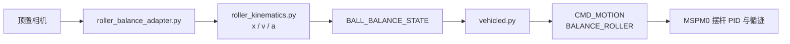

# 车载平衡滚珠控制

本功能用于 H 题的 25 cm 凹槽摆杆：摄像头固定在管槽正上方，RDK 输出钢球相对中心 O 的
一维位置、速度和加速度；MSPM0 保持摆杆电机与红外循迹的本地高频闭环。网页只用于观察。

## 数据链路

## 标定

在 `config/camera.yaml` 的 `camera.calibration.roller_balance` 中填写：

| 字段 | 含义 |
|---|---|
| `roi_xyxy` | 覆盖管槽内壁的图像矩形 `[x1,y1,x2,y2]` |
| `center_x_px` | 中心 O 对应的钢球中心像素横坐标 |
| `mm_per_pixel` | 管槽轴方向的毫米/像素比例 |
| `axis_direction` | 图像向右映射为正方向时为 `1`，反向时为 `-1` |

应在管槽中心和至少两个已知刻度位置复核换算误差。不要使用现有电磁铁捕获单应矩阵代替
此标定；两者的坐标系和物理目标不同。

## 启用

1. 保持 `vehicle.control_enabled: false`，只开启 `roller_balance` 插件，确认网页中的
   ROI、中心线、位置、速度和加速度方向正确。
2. 保持 `vehicle.control_enabled: false`，设置 `vehicle.balance.enabled: true`、真实 UART
   配置和 `vehicle.balance.output_only: true`，验证 M0 或逻辑分析仪收到 20 字节平衡状态帧，
   且 `enabled=0,balance_valid=1`。仅输出模式可越过总控开关发送测量值，但绝不授权 MSPM0
   执行运动。
3. 车轮悬空、急停有效时关闭 `output_only` 并开启 `control_enabled`。M0 必须在视觉状态或
   心跳过期时停止积分并进入安全摆杆策略。

默认 `target_mm: 0` 对应中心 O。静态测试可在 `config/vision.yaml` 的
`roller_balance.config.target_mm` 修改目标，例如 `50` 和 `-50` 对应题目的 ±5 cm。
