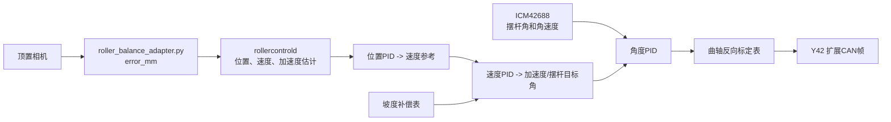

# 滚珠直接 CAN 闭环控制

本链路用于 Y42 步进电机、曲轴和 25 cm 摆杆。它与现有
`scripts/run_roller_balance_uart.sh` 完全独立：后者继续把 `error_mm` 安全地发送给
MSPM0；本链路不启动 `vehicled`，只订阅 `visiond` 的本机事件并调用
`/userdata/rdkstudio/projects/canstep/can_driver.py` 的 Y42 CAN 协议实现。

## 安全条件

- 初始 `config/roller_control.yaml` 中 `enabled: false`；即使传入 `--arm` 也不会使能电机。
- 实际执行须同时设置 `enabled: true` 并显式传入 `--arm`。
- `--dry-run` 不驱动电机；默认不打印 TX 帧，需要联调报文时追加 `--show-tx`。
- `--home` 可在闭环启动前执行一次绝对坐标回零；该动作必须同时使用 `--arm`，完成后才进入视觉闭环。
- ICM-42688-P 身份寄存器必须读取为 `0x47`；识别失败时进程在使能电机前退出。
- 钢球事件超过 `state_timeout_ms` 未更新时，控制器立即停止发送位置更新并向已使能的
  Y42 发送停止命令。

## 数据与控制层



`slope_bias_deg_by_position` 用于抵消水管本身沿长度方向的固定坡度。当前相机的
位置误差约为 1 mm，因此无需重做视觉几何；只需在多个物理位置上记录“让钢球静止所需的
摆杆角”，填入该表并由程序线性插值。

`motor_deg_by_tube_angle` 是曲轴标定表，输入为摆杆实际角度，输出为 Y42 的绝对电机角。
`control.tilt_sign` 是视觉钢球误差到目标水管倾角的方向开关；若钢球偏离中心后坡度会继续把它推向同一端，
只将该值在 `1` 与 `-1` 间翻转，不要反转曲轴标定表。
曲轴在安全行程内必须单调；配置中示例的 `[-8,-80] [0,0] [8,80]` 只是占位，绝不能直接
用于真实设备。

曲轴自动标定已通过只读 `1A` 确认本机为 EMM 固件，因此遵循 `protocol.md` 的 EMM `FD` 位置帧：
`Dir + Speed(u16 RPM) + Acc(u8) + Pulses(u32) + MoveMode`。全量配置 `42` 的细分为 `0x10`，
所以采用 3200 脉冲/圈。该 EMM 的 `MoveMode=01/02` 不接受位置目标，因此标定采用协议示例使用的
`MoveMode=00`（相对上一输入目标）：每一步从 `33` 已确认的目标位置计算脉冲增量。读取位置达到
目标后才采样 IMU，也不会在电机未实际到位时记录标定数据。
EMM 位置命令后读取 `33` 目标位置与 `36` 实时位置验证执行，不依赖电机的 `FD` 主动应答模式；
X 固件仍等待 `FD 02`、`FD 9F`、`FD E2` 或 `FD EE`。等待时间根据本次位移和设定 RPM 计算，
避免低速大位移时在到位前误发停止命令。
在第一个位置命令前还会读取 `3A`：必须存在 `Ens_TF=01`，且不能有 `Cgp_TF=08` 堵转保护。

## 电机软限位与曲轴标定

控制器和 Y42 CAN 发送层都会将目标截断到 `motor.soft_limit_min_deg` 与
`motor.soft_limit_max_deg`。EMM 的读取值按 `raw × 360 / 65536` 换算为角度，而此前软限位按 X 的
`raw ÷ 10` 记录，已经被标为失效；重新采集并写入 EMM 软限位前，程序拒绝自动曲轴标定。
完成一次标定后，才允许将 `enabled` 设为 `true`。

先停掉任何 `run_roller_balance_can.sh` 进程，松开曲轴连接轴，让电机不带机构负载，然后运行：

```bash
./scripts/calibrate_roller_control.sh limits --margin-deg 2 --apply
```

脚本会先向 Y42 发送 `disable` 松轴；分别手动转到两个安全端（不要顶住硬限位），每次选择
`1` 后读取 Y42 多圈实时位置，扣除 `2°` 安全余量。交互入口内所有确认均使用 `1/2` 选择；
命令行入口可继续用 `--apply` 直接写入软限位。
EMM 实时位置使用协议规定的 `raw × 360 / 65536` 角度换算。
脚本同时显示单圈编码器角；若电机带减速箱，可配置 `position_deg_per_output_deg` 仅用于显示
输出轴换算值，不会改变 CAN 控制坐标。

软限位采集和自动曲轴映射标定结束后，脚本用两次 `1/2` 选择：第一次选择保持松轴或使能锁紧，第二次选择不回零或
倒计时 2 秒后，脚本仅发送固定绝对零点回零帧 `9A 04 00 6B`，不会发送 `93` 保存零点或修改
回零参数。随后轮询 `3B` 回零状态：`04` 表示进行中，`08` 表示失败。无论是否回中，只要已经
使能，脚本退出后都会保持使能锁紧；不使能则保持松轴。

重新锁紧曲轴、清空水管内钢球并确认急停有效后，先将 `roller_control.yaml` 的 `enabled` 改为
`true`。以下命令以 `5 RPM`、7 个采样点移动，每点静置并用 IMU 平均水管角，自动生成
`motor_deg_by_tube_angle`：

```bash
./scripts/calibrate_roller_control.sh map --apply
```

若测得曲轴行程不是单调的一对一关系，脚本会拒绝写入映射，并在错误中按水管倾角输出
`水管角/电机角` 采样对；应据此缩小软限位到单调工作段后重新采集。
标定完成后把 `enabled` 恢复为 `false`，先执行 `run_roller_balance_can.sh --dry-run` 核对待发 CAN 帧。

## ICM42688 接线确认

当前配置使用 `i2c-5`、地址 `0x69`。ICM42688 的 `CS` 必须保持高电平以选择 I2C，
`SCL/SDA` 接 RDK X5 的 I2C5：扩展排针物理 `Pin 3`、`Pin 5`（分别为 GPIO10、GPIO11；按开发板 I2C5 的 SDA/SCL 丝印连接）。I2C5 与 UART3 的复用引脚相同，不能在该对引脚上再接 UART3；项目使用的 `/dev/ttyS1` 是 UART1，不与 I2C5 冲突。传感器必须装在会随摆杆转动的部件上，否则只能测到车架姿态，不能闭合摆杆角度环。
若模块的 AD0 地址脚为低电平，则把 `i2c_address` 改为 `0x68`。

正常探测时，读取寄存器 `0x75` 的结果是 `0x47`。运行 `probe_icm42688.sh` 前应确认
`/dev/i2c-5` 存在；不要在 `WHO_AM_I` 仍为 `0x00` 时启用本链路。

安装后需要确认 `slope_accel_axis`、`gravity_accel_axis`、`gyro_axis` 及三个方向符号。摆杆
水平静止时角度应接近 0°；将摆杆向正方向缓慢抬起时，显示角度和电机正方向必须一致。

## 启动顺序

先完成相机、IMU、电机零点、曲轴和坡度标定。台架首次运行：

```bash
cd /userdata/rdkstudio/projects/robot_car
./scripts/probe_icm42688.sh
./scripts/monitor_icm42688.sh --samples 20
./scripts/run_roller_balance_can.sh --dry-run --show-tx
```

该命令会启动现有网页和视觉服务；只有 ICM42688 已被识别后，才会进入控制循环。默认隐藏 TX 帧，
需要检查报文时使用 `--show-tx`。
`monitor_icm42688.sh` 不启动视觉、CAN 或电机，用于确认静止噪声、安装轴和正负方向；让水管
向预期正方向缓慢抬起时，`pitch_deg` 应单调增加，否则调整 `imu` 的轴或符号配置。
当前安装中水管纵向为 IMU `z`、向上法线为 `y`、转轴为 `x`。在水管置于机械零点时记录
`monitor_icm42688.sh --calibrate-samples 100` 输出的两个数，填入 `imu.pitch_zero_offset_deg` 和
`imu.gyro_bias_raw`；之后显示和控制使用的角度即以机械零点为 `0°`，且不会积分静止陀螺仪偏置。
姿态融合使用 Mahony 单轴等效 PI：`mahony_kp` 将当前角度拉回加速度计重力角，`mahony_ki`
用于缓慢补偿残余陀螺仪偏置。当前 `Kp=8.0 /s`、`Ki=0`，水管回零时优先快速消除残余角；确认
电机运行中的加速度扰动后，再决定是否启用积分项。
确认方向、角度范围和 Y42 报文后，再将配置的 `enabled` 改为 `true`，车轮悬空、急停有效时
执行：

```bash
./scripts/run_roller_balance_can.sh --arm --target-mm 0
```

`--target-mm` 可在已标定范围内设为 `-50`、`0`、`50` 等目标。每次改 PID 时先降低
`speed_rpm`、`tube_angle` 限幅和位置目标，再逐步增加；先完成静态中心、`±50 mm` 往返和
任意点保持，最后才进行小车行驶测试。

当前 EMM 的 `FD Speed` 单位为 RPM。若钢球变化比机构响应更快，可在确认软限位、方向和急停后
逐级提高 `motor.speed_rpm`；当前台架设置为 `60 RPM`，不要以提高 PID 增益替代这一机械响应调节。

## 闭环遥测

排查震荡时可启用控制进程内的低频遥测：

```bash
./scripts/run_roller_balance_can.sh --telemetry-hz 5
```

题 3 调参时可使用以下组合：

```bash
./scripts/run_roller_balance_can.sh --task 2 --arm --auto-confirm --telemetry-hz 10
```

`--auto-confirm` 仅用于调参，回中误差需连续保持在 `±5 mm` 超过 `2.1 s` 后自动开始计时；
正常测试不加该选项，仍由操作员输入 `Y` 确认。到 `+50 mm` 后，控制器会等待位置误差不超过
`6 mm` 且估计速度不超过 `20 mm/s` 才切换到 `-50 mm`，避免带着明显速度直接反向。
计时在 `-50 mm` 稳定后结束，但控制器会继续闭环保持在该位置，直到手动停止进程。

这不会使能或移动电机，但会按协议 `11 18` 订阅 Y42 的 `3C` 合并状态，并在每次遥测时主动读取 `36` 实时位置，输出
视觉钢球位置/速度、IMU 水管角、期望水管角、命令电机角和实际电机角。加上 `--arm` 才会实际闭环运动。
程序退出时会发送周期 `0000` 停止主动返回；请勿在控制程序外另开进程读取同一电机应答。
