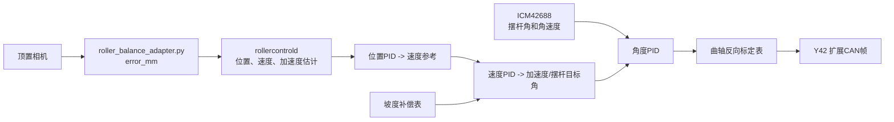

# 滚珠直接 CAN 闭环控制

本链路用于 Y42 步进电机、曲轴和 25 cm 摆杆。它与现有
`scripts/run_roller_balance_uart.sh` 完全独立：后者继续把 `error_mm` 安全地发送给
MSPM0；本链路不启动 `vehicled`，只订阅 `visiond` 的本机事件并调用
`/userdata/rdkstudio/projects/canstep/can_driver.py` 的 Y42 CAN 协议实现。

## 安全条件

- 初始 `config/roller_control.yaml` 中 `enabled: false`；即使传入 `--arm` 也不会使能电机。
- 实际执行须同时设置 `enabled: true` 并显式传入 `--arm`。
- `--dry-run` 只打印待发送的 Y42 CAN 帧，不能驱动电机。
- ICM-42688-P 身份寄存器必须读取为 `0x47`；识别失败时进程在使能电机前退出。
- 钢球事件超过 `state_timeout_ms` 未更新时，控制器立即停止发送位置更新并向已使能的
  Y42 发送停止命令。

## 数据与控制层



`slope_bias_deg_by_position` 用于抵消水管本身沿长度方向的固定坡度。当前相机的
位置误差约为 1 mm，因此无需重做视觉几何；只需在多个物理位置上记录“让钢球静止所需的
摆杆角”，填入该表并由程序线性插值。

`motor_deg_by_tube_angle` 是曲轴标定表，输入为摆杆实际角度，输出为 Y42 的绝对电机角。
曲轴在安全行程内必须单调；配置中示例的 `[-8,-80] [0,0] [8,80]` 只是占位，绝不能直接
用于真实设备。

## ICM42688 接线确认

若模块接在 SPI1 的 `CSN1`，当前目标就是 `spi1.1`；原厂数据手册 `DS-000347` 支持 SPI 模式 0 或 3，当前配置使用模式 3。传感器必须装在会随摆杆转动的部件上，
否则只能测到车架姿态，不能闭合摆杆角度环。

正常探测时，读取寄存器 `0x75` 的结果是 `0x47`，首个 MOSI 字节应为 `0xF5`。当前现场探测的 `spi1.0` 和 `spi1.1`
均返回 `0x00`，需先检查 VCC、GND、MISO、MOSI、SCLK、CS，以及模块的 SPI/I2C 模式选择。
不要在 `WHO_AM_I` 仍为 `0x00` 时启用本链路。

安装后需要确认 `slope_accel_axis`、`gravity_accel_axis`、`gyro_axis` 及三个方向符号。摆杆
水平静止时角度应接近 0°；将摆杆向正方向缓慢抬起时，显示角度和电机正方向必须一致。

## 启动顺序

先完成相机、IMU、电机零点、曲轴和坡度标定。台架首次运行：

```bash
cd /userdata/rdkstudio/projects/robot_car
./scripts/probe_icm42688.sh 1
./scripts/run_roller_balance_can.sh --dry-run
```

该命令会启动现有网页和视觉服务；只有 ICM42688 已被识别后，才会输出待发送的 CAN 帧。
确认方向、角度范围和 Y42 报文后，再将配置的 `enabled` 改为 `true`，车轮悬空、急停有效时
执行：

```bash
./scripts/run_roller_balance_can.sh --arm --target-mm 0
```

`--target-mm` 可在已标定范围内设为 `-50`、`0`、`50` 等目标。每次改 PID 时先降低
`speed_rpm`、`tube_angle` 限幅和位置目标，再逐步增加；先完成静态中心、`±50 mm` 往返和
任意点保持，最后才进行小车行驶测试。
