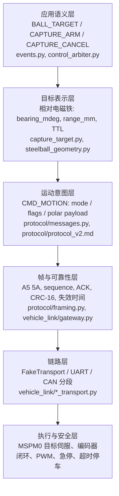

# 钢球捕获的单一语义运动链路

本文件说明 YOLO26 分割识别钢球后，如何将钢球对准车身电磁铁的捕获点。本项目不修改
相邻的 `ultralytics_yolo26`、`26TI-PaddleOCR` 或共享 `utils` 仓库；默认配置不打开
相机、真实传输、车控或捕获。

## 结论

离散事件如 `TURN_LEFT`、`TURN_RIGHT` 无法完成毫米级对准，因为它们没有钢球相对
电磁铁的距离、角度、置信度和时效。v2 只有一条车辆运动链路：所有车辆行为均使用
`CMD_MOTION`，由 `mode` 区分巡线、视觉辅助与 `CAPTURE_TARGET_POLAR`。

| 模式 | RDK 发送 | MSPM0 执行 |
|---|---|---|
| `LINE_FOLLOW` | 仅模式、使能和有效期 | 本地巡线、速度策略与电机闭环 |
| `VISION_ASSIST` | 仅模式、使能和有效期 | 本地视觉辅助策略与安全停车 |
| `CAPTURE_TARGET_POLAR` | 钢球相对电磁铁的方位角、距离、置信度、时延与捕获许可 | 对齐、低速接近、急停、磁铁动作与电机闭环 |

RDK 永不发送左右轮速度、转向角或 PWM；每个发送周期只发送一条 `CMD_MOTION`。MSPM0
始终拥有急停、心跳/目标超时停车和最终电机控制权。

## 从一颗钢球到捕获

假设已完成地面平面标定。当前图像中钢球的像素底部点被解算为
`forward_mm=680`、`lateral_mm=-145`，即相对电磁铁前方 680 mm、左侧 145 mm；
对应 `bearing_mdeg=-12036`、`range_mm=695`。

```mermaid
flowchart LR
    A[钢球实景] --> B[camera/capture.py<br/>CameraFrame]
    B --> C[perception/scheduler.py]
    C --> D[perception/steelball_adapter.py<br/>YOLO26 DET/Seg.predict]
    D --> E[perception/steelball_geometry.py<br/>像素点转电磁铁坐标]
    E --> F[perception/events.py<br/>BALL_TARGET]
    F --> G[ipc/schemas.py + ipc/vision_socket.py<br/>UDS JSON-lines]
    G --> H[vehicled.py]
    H --> I[decision/state_machine.py<br/>CAPTURE_TARGET_POLAR]
    H --> J[decision/control_arbiter.py<br/>单一 MotionTarget]
    J --> K[decision/capture_target.py<br/>角度、距离、TTL]
    K --> L[vehicle_link/gateway.py]
    L --> M[protocol/messages.py<br/>CMD_MOTION]
    M --> N[protocol/framing.py + UART/CAN]
    N --> O[MSPM0 本地目标伺服]
    O --> P[电机闭环、对齐、电磁铁]
```

1. `camera/capture.py` 是唯一摄像头拥有者，为图像建立带单调时间戳的 `CameraFrame`。
2. `scheduler.py` 调用 `steelball_adapter.py`，后者只复用
   `ultralytics_yolo26/runtime/python/yolo26_det.py` 或 `yolo26_seg.py` 的对应运行时，
   不启动其 Web 程序，也不重复打开摄像头。
3. adapter 选取目标类别中边界框底边最低的实例；置信度仅在底边相同时用于决胜。
   `steelball_geometry.py` 使用 3x3 单应矩阵把底边中点投影到相对电磁铁的地面坐标，
   并计算方位角和距离。未标定时只产生
   `STEELBALL_DETECTED`，不会进入捕获模式。
4. `events.py` 形成带帧号、置信度和 TTL 的 `BALL_TARGET`，经 UDS 发布。`vehicled.py`
   同时交给状态机和仲裁器。
5. 捕获开关开启时，状态机选择 `CAPTURE_TARGET_POLAR`；仲裁器校验目标字段和时效，
   再生成唯一的 `MotionTarget`。
6. `gateway.py` 再检查 `control_enabled`、捕获开关和目标时效，编码 v2 `CMD_MOTION`。
   没有新鲜有效目标时发送 `enabled=0,target_valid=0` 的极坐标安全帧。
7. MSPM0 根据 `bearing_mdeg` 和 `range_mm` 做局部闭环修正，并在捕获窗口内决定磁铁
   动作。RDK 不参与电机级控制。

## 协议栈式分层

越靠下的层越接近硬件，也越能在 RDK 帧率波动、视觉目标丢失或 RDK 进程异常时独立
停车。

## 电磁铁反馈开关

`vehicle.capture.feedback.enabled` 默认是 `false`。此时即使 MSPM0 已发出磁铁动作，
也只能上报 `CAPTURE_ATTEMPTED`，不能声称 `CAPTURED`。接入并验证 `hall`、`current`、
`switch` 或 `vision` 反馈后，才可开启反馈并信任 `capture_state=CAPTURED/CAPTURE_FAILED`。

`no_feedback_policy` 约定无反馈时的上报语义、磁铁保持策略和最长保持时间；Python 端
不会从视觉结果推断已经吸住钢球。

## 标定与启用顺序

真实矩阵保存到 `/userdata/robot-car/calibration/`，不提交 Git。单应矩阵将图像像素
`(u,v,1)` 映射为以电磁铁地面投影点为原点的 `(forward_mm,lateral_mm,1)`；正前方为
`forward_mm > 0`，左右符号必须与 MSPM0 方位角约定一致。

1. 保持相机、真实传输、`control_enabled` 和捕获开关关闭。
2. 用多个已量测位置的钢球完成单应矩阵标定，验证中心、左右和远近点的误差与符号。
3. 以 FakeTransport 验证 `BALL_TARGET` 生成一条有效的极坐标 `CMD_MOTION`，并验证
   过期目标变为安全帧。
4. 车轮悬空且急停有效时再接入真实链路，确认 ACK、目标超时和安全帧；最后由现场人员
   显式打开车控与捕获开关。

MSPM0 固件必须实现 v2 字段校验、目标阈值、局部控制器、电磁铁驱动和反馈采样。
