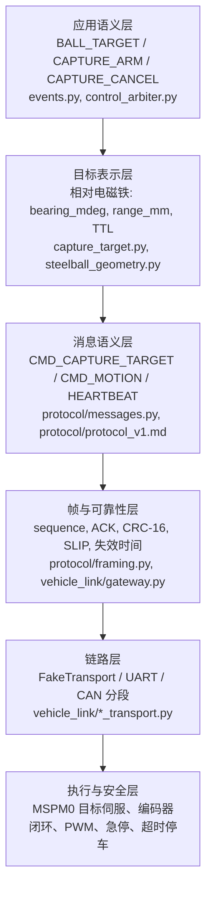

# 钢球捕获双控制链路

本文件说明 YOLO26 分割识别钢球后，如何让小车把钢球对准车身电磁铁的捕获点。
它不改变相邻 `ultralytics_yolo26`、`26TI-PaddleOCR` 或共享 `utils` 仓库。
默认配置不打开相机、真实传输、车控或捕获。

## 结论和命名

仅有 `TURN_LEFT`、`TURN_RIGHT` 之类离散语义事件的链路无法完成可靠的毫米级对准：
事件没有钢球相对电磁铁的距离、角度、时间戳和失效时间，RDK 也无法据此要求
MSPM0 以本地闭环持续修正。因此本项目保留两条互斥链路：

| 名称 | 配置值 | RDK 发送内容 | MSPM0 职责 | 适用场景 |
|---|---|---|---|---|
| RDK 运动目标链路 | `RDK_MOTION_TARGET` | `CMD_MOTION`：模式、速度、转向、限速 | 把高层运动目标变为本地电机闭环和 PWM | 巡线、路口、OCR 指令等常规驾驶 |
| MCU 目标伺服链路 | `MCU_TARGET_SERVO` | `CMD_CAPTURE_TARGET`：钢球相对电磁铁的角度和距离 | 追球、对齐、低速接近、急停、磁铁动作和电机闭环 | 钢球精确捕获 |

`control_arbiter.py` 在一个发送周期内只选择一种命令类别。捕获伺服期间 RDK
不会同时发送普通 `CMD_MOTION`，避免两个控制器争夺方向和速度。MSPM0 始终保留
急停、目标/心跳超时停车和 PWM 最终控制权。

## 从一颗钢球到捕获的实例

场地中有一颗钢球，电磁铁位于车体前方中心。已完成地面平面标定，当前帧中钢球
像素底部点被解算为 `forward_mm=680`、`lateral_mm=-145`，即钢球在电磁铁前方
680 mm、左侧 145 mm；对应 `bearing_mdeg=-12036`、`range_mm=695`。

```mermaid
flowchart LR
    A[钢球实景] --> B[camera/capture.py<br/>CameraFrame]
    B --> C[perception/scheduler.py]
    C --> D[perception/steelball_adapter.py<br/>YOLO26Seg.predict]
    D --> E[perception/steelball_geometry.py<br/>像素底部点 -> 电磁铁坐标]
    E --> F[perception/events.py<br/>BALL_TARGET]
    F --> G[ipc/schemas.py + ipc/vision_socket.py<br/>UDS JSON-lines]
    G --> H[vehicled.py]
    H --> I[decision/state_machine.py<br/>CAPTURE_SERVO]
    H --> J[decision/control_arbiter.py]
    J --> K[decision/capture_target.py<br/>角度、距离、TTL]
    K --> L[vehicle_link/gateway.py]
    L --> M[protocol/messages.py<br/>CMD_CAPTURE_TARGET]
    M --> N[protocol/framing.py + UART/CAN]
    N --> O[MSPM0 本地目标伺服]
    O --> P[电机闭环、对齐、电磁铁]
```

实际时序如下：

1. `camera/capture.py` 是唯一摄像头拥有者，为图像创建带单调时间戳的 `CameraFrame`。
2. `perception/scheduler.py` 调用 `steelball_adapter.py`。该 adapter 只复用
   `/userdata/rdkstudio/projects/ultralytics_yolo26/runtime/python/yolo26_seg.py`
   中的 `YOLO26Seg`，不启动其 Web 程序，也不再打开一次摄像头。
3. adapter 选择目标类别中置信度最高的实例，取 bbox 的底边中点；
   `steelball_geometry.py` 用标定的 3x3 单应矩阵把该像素投影为相对电磁铁的
   `forward_mm/lateral_mm`，并推得方位角和距离。未标定时仅发
   `STEELBALL_DETECTED`，不会启动目标伺服。
4. `perception/events.py` 形成带帧号、置信度和 TTL 的 `BALL_TARGET`，经
   `ipc/schemas.py` 和 `ipc/vision_socket.py` 发布。`vehicled.py` 接收后同时
   交给状态机和仲裁器。
5. 当 `vehicle.capture.enabled=true` 且模式为 `MCU_TARGET_SERVO` 时，
   `state_machine.py` 进入 `CAPTURE_SERVO`；`control_arbiter.py` 通过
   `capture_target.py` 检查字段、时效并选中捕获链路。
6. `vehicle_link/gateway.py` 再次检查 `control_enabled`、capture 开关、模式和
   目标有效期，通过 `protocol/messages.py` 编码二进制 `CMD_CAPTURE_TARGET`，再由
   `protocol/framing.py` 和 UART/CAN 传输发给 MSPM0。
7. MSPM0 以收到的 `bearing_mdeg` 和 `range_mm` 对车身做低速闭环修正。当球达到
   电磁铁的捕获窗口后，由 MSPM0 执行磁铁动作；RDK 从不直接下发左右轮 PWM。

## 协议栈式分层

上层只表达“钢球相对电磁铁在哪里”，不表达电机占空比。越靠下的层越接近硬件，
也越能在 RDK 帧率波动、视觉目标丢失或 RDK 进程异常时独立停车。

## `CMD_CAPTURE_TARGET` 与安全语义

该命令的字段为 `flags`、`track_id`、`bearing_mdeg`、`range_mm`、
`confidence_permille`、`measurement_age_ms` 和 `valid_for_ms`。`flags.bit0` 表示
目标有效，`flags.bit1` 表示 RDK 已允许 MSPM0 尝试捕获。无新鲜目标、格式错误、
TTL 超时、`control_enabled=false`、捕获开关关闭或模式不匹配时，网关会发送
`target_valid=0` 的安全帧；MSPM0 必须停止捕获运动。

`CAPTURE_ARM` 和 `CAPTURE_CANCEL` 是低频控制事件，使用 `CMD_EVENT`。取消会清除
RDK 缓存目标并让状态机回到配置的初始驾驶状态。捕获目标是高频二进制消息，避免
用 JSON 承担实时目标更新。

## 电磁铁反馈开关

`vehicle.capture.feedback.enabled` 默认为 `false`。在此模式下，MSPM0 即使执行了
磁铁动作，也只能将 `capture_attempted=true` 回报为 `CAPTURE_ATTEMPTED`，不能声称
`CAPTURED`。只有接入并验证 `hall`、`current`、`switch` 或 `vision` 反馈后，才能
设置 `feedback.enabled: true` 并信任 `capture_state=CAPTURED/CAPTURE_FAILED`。

`no_feedback_policy` 规定无反馈时的上报语义、磁铁保持策略和最长保持时间。它是
MSPM0 固件须遵守的策略契约；Python 端不会从视觉结果推断“已经吸住钢球”。

## 标定与启用顺序

真实矩阵保存到 `/userdata/robot-car/calibration/`，不提交 Git。单应矩阵映射
图像像素 `(u,v,1)` 到以电磁铁地面投影点为原点的
`(forward_mm,lateral_mm,1)`。正前方为 `forward_mm > 0`；左右正负号必须与
MSPM0 的转向约定一致。当前实现把 bbox 底边中心作为地面接触点，并拒绝投影到
车后方的目标。

1. 保持 `camera.enabled=false`、`transport.enabled=false`、`control_enabled=false`。
2. 在地面放置多个已量测位置的钢球，离线求 3x3 单应矩阵并写入运行目录的 YAML。
3. 仅开启相机和 `steelball_segmentation`，验证画面中中心、左右和远近点的
   `forward_mm/lateral_mm` 符号及误差。
4. 使用 FakeTransport 验证 `BALL_TARGET` 会生成正确的捕获命令，且普通
   `CMD_MOTION` 不与其同周期发送。
5. 车轮悬空并保持急停有效，首次真实链路仍令 `control_enabled=false`，检查 ACK、
   目标超时和安全帧；最后才由现场人员显式开启车控、捕获开关和反馈配置。

MSPM0 固件尚需实现 `CMD_CAPTURE_TARGET` 的字段校验、阈值、局部控制器、电磁铁
驱动及反馈采样。本仓库的 Python 端只定义并测试到协议出口的行为。
