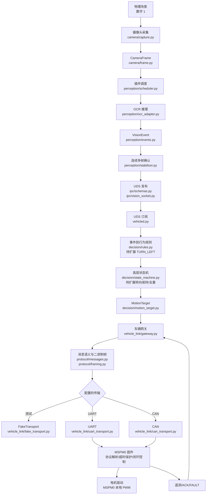
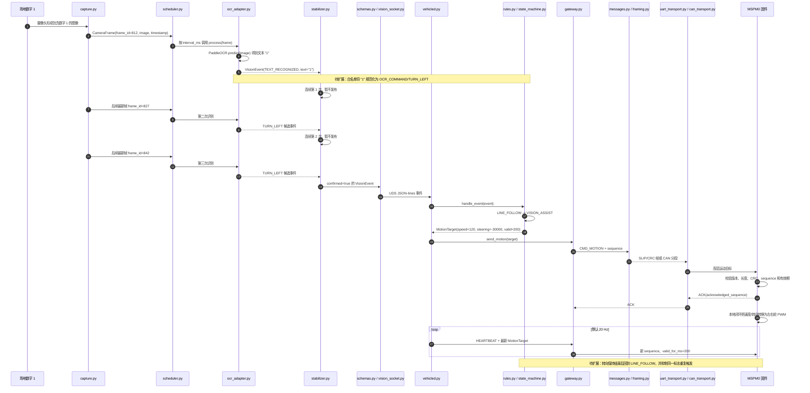
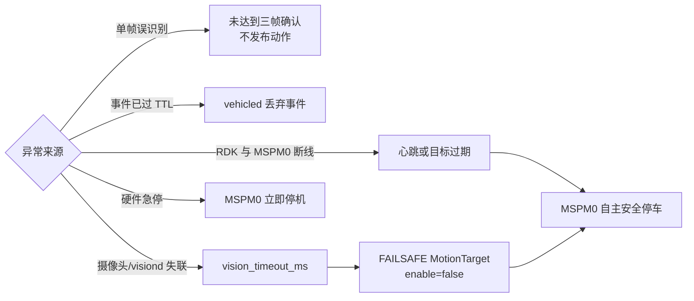

# 从视觉识别到车辆运动的通信流程

本文抽象说明一条视觉信息如何从摄像头进入 RDK，经视觉插件、高层决策和
通信协议到达 MSPM0。数字 `1` 左转、数字 `2` 右转作为贯穿示例。

> 当前实现状态：摄像头、OCR adapter、统一事件、UDS、状态机、运动目标和
> MSPM0 协议链路已经存在；`1 -> TURN_LEFT`、`2 -> TURN_RIGHT` 的白名单
> 转换、转向保持时间和重复触发抑制尚未实现。图中用“待扩展”标出这些节点。

除配置、协议文档和 MSPM0 固件外，下文图表中省略前缀的 Python 文件均位于
`src/robot_car/`。

## 分层抽象

整条链路只在相邻层之间传递结构化数据，不允许视觉插件越过状态机直接控制
电机，也不允许 `vehicled` 依赖具体的 YOLO 或 OCR 类型。



边界约束：

- `visiond.py` 是唯一摄像头所有者和视觉插件宿主。
- `VisionEvent` 是视觉层对外唯一业务数据格式。
- `vehicled.py` 是 RDK 到 MSPM0 的唯一通信出口。
- `MotionTarget` 只包含模式、速度、转向、限速和有效期，不包含左右轮 PWM。
- MSPM0 独立负责硬件急停、超时停车、编码器/IMU/灰度闭环和 PWM。

## 单次左转的时序

下面假定 OCR 已启用，规则层已配置数字白名单，并约定负转向角表示左转。



## 每一步的数据和文件

| 步骤 | 输入 | 处理与输出 | 经过的文件 | 当前状态 |
|---:|---|---|---|---|
| 1 | 物理画面 | 打开配置指定的唯一摄像头 | `config/camera.yaml`、`camera/capture.py` | 已实现，默认关闭 |
| 2 | OpenCV 图像 | 增加帧号、单调时间戳和尺寸，形成 `CameraFrame` | `camera/frame.py`、`camera/capture.py` | 已实现 |
| 3 | 最新帧 | 按插件间隔、优先级和最大处理时间调度 OCR | `config/vision.yaml`、`perception/scheduler.py` | 已实现 |
| 4 | `CameraFrame` | 调用现有 PaddleOCR，产生 `TEXT_RECOGNIZED` | `perception/plugin.py`、`perception/ocr_adapter.py` | 已实现 |
| 5 | 文本 `"1"` | 仅允许白名单转换为 `OCR_COMMAND/TURN_LEFT` | `perception/events.py`、`decision/rules.py` | 待扩展 |
| 6 | TURN_LEFT 候选事件 | 连续三次确认、检查 TTL | `perception/stabilizer.py` | 已实现；命令需提供稳定键 |
| 7 | 已确认事件 | 加 schema 版本并以 JSON-lines 通过 UDS 发布 | `ipc/schemas.py`、`ipc/vision_socket.py` | 已实现 |
| 8 | UDS 数据 | 自动连接/重连、反序列化为 `VisionEvent` | `ipc/vision_socket.py`、`vehicled.py` | 已实现 |
| 9 | `OCR_COMMAND` | 将 `TURN_LEFT` 映射为高层状态机动作 | `decision/rules.py` | 待扩展 |
| 10 | 左转动作 | 进入 `VISION_ASSIST`，管理保持、结束和冷却 | `decision/state_machine.py` | 状态已实现，转向逻辑待扩展 |
| 11 | 状态机状态 | 产生 `MotionTarget`，例如速度 120、转向 -30000 | `decision/motion_target.py`、`decision/state_machine.py` | 结构已实现，转向赋值待扩展 |
| 12 | `MotionTarget` | 应用 `control_enabled` 安全门控并分配 sequence | `config/vehicle.yaml`、`vehicle_link/gateway.py` | 已实现 |
| 13 | 运动字段 | 编码 `CMD_MOTION`、CRC-16 和 UART/CAN 帧 | `protocol/messages.py`、`protocol/framing.py` | 已实现 |
| 14 | 二进制帧 | 发送到 Fake、UART 或 CAN | `config/transport.yaml`、`vehicle_link/*_transport.py` | 已实现，真实传输默认关闭 |
| 15 | `CMD_MOTION` | MSPM0 校验并返回 ACK，缓存带有效期的目标 | `protocol/protocol_v1.md`、未来 MSPM0 C 工程 | 固件待实现 |
| 16 | 速度和转向目标 | MSPM0 本地闭环生成左右电机 PWM | 未来 MSPM0 电机/编码器/IMU 工程 | 固件待实现 |
| 17 | ACK/遥测/故障 | 解码并更新 ACK 统计和遥测缓存 | `vehicle_link/gateway.py`、`vehicle_link/telemetry.py` | Python 端已实现 |

## 示例数据如何逐层变化

### 1. OCR 原始结果

```json
{
  "text": "1",
  "polygon": [[420, 180], [510, 180], [510, 360], [420, 360]]
}
```

### 2. 标准视觉事件

白名单转换后，建议形成以下事件，而不是把原始文本直接交给电机控制：

```json
{
  "timestamp_monotonic_ms": 5835210,
  "frame_id": 842,
  "source": "ocr",
  "event_type": "OCR_COMMAND",
  "confidence": 1.0,
  "ttl_ms": 150,
  "payload": {
    "command": "TURN_LEFT",
    "recognized_text": "1",
    "stable_id": "TURN_LEFT"
  },
  "image_width": 1280,
  "image_height": 720,
  "confirmed": true
}
```

### 3. 高层运动目标

示例约定负数为左转，具体数值必须在实车标定后配置：

```json
{
  "mode": "VISION_ASSIST",
  "enable": true,
  "target_speed_mm_s": 120,
  "target_steering_mdeg": -30000,
  "speed_limit_mm_s": 150,
  "valid_for_ms": 200
}
```

如果 `vehicle.control_enabled` 仍为 `false`，`gateway.py` 会把上述目标强制
改为禁用、零速度和零转向。识别成功不等于允许真实车辆动作。

### 4. MSPM0 命令语义

`protocol/messages.py` 使用 `>BBiiIH` 编码 `CMD_MOTION` payload：

```text
mode:u8                 = 3
enable:u8               = 1
target_speed_mm_s:i32   = 120
target_steering_mdeg:i32= -30000
speed_limit_mm_s:u32    = 150
valid_for_ms:u16        = 200
```

`protocol/framing.py` 再增加版本、消息类型、sequence、payload 长度和
CRC-16/CCITT。UART 使用 `0x7E` 分帧；Classical CAN 使用协议文档规定的
7 字节数据分段。

## 安全路径



相关实现文件：

- 视觉健康与事件发布：`visiond.py`
- 视觉超时和安全状态：`decision/state_machine.py`
- RDK 链路超时：`vehicle_link/watchdog.py`
- 禁用目标门控：`vehicle_link/gateway.py`
- MSPM0 超时要求：`protocol/protocol_v1.md`

## 扩展同类业务的方法

其他视觉动作沿用同一条流水线，只替换事件规范化和业务规则。例如：

```text
二维码 "PARK" -> QR_COMMAND/PARK -> rules.py -> PARKING MotionTarget
红色标记       -> COLOR_MARKER/STOP -> rules.py -> disabled MotionTarget
路口检测       -> INTERSECTION -> rules.py -> VISION_ASSIST MotionTarget
```

新增视觉插件不应修改 `camera/capture.py`、`vehicle_link/` 或底层协议；新增
动作也不应让 adapter 直接访问串口/CAN。这样每一层都可以使用 FakeTransport、
模拟事件或录像回放独立测试。
