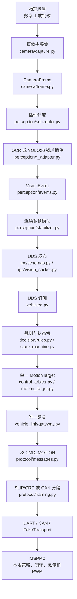
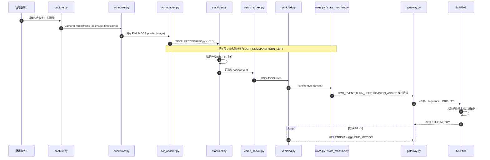
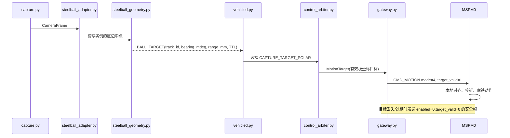
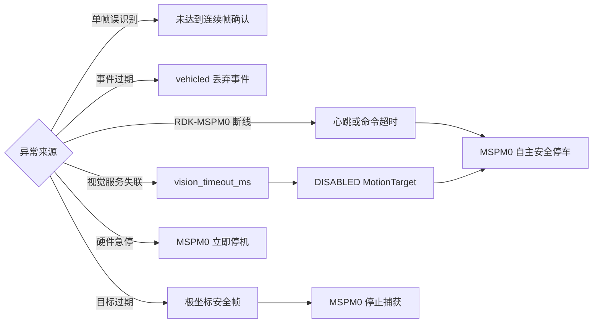

# 从视觉识别到车辆运动的通信流程

本文说明视觉信息如何从摄像头到达 MSPM0。数字 `1` 左转、数字 `2` 右转是业务事件
示例；钢球捕获使用同一通信链路的 `CAPTURE_TARGET_POLAR` 模式。除配置、协议文档和
MSPM0 固件外，下文文件均位于 `src/robot_car/`。

> 当前实现已经具备摄像头、OCR adapter、统一事件、UDS、状态机和 v2 运动协议。
> `1 -> TURN_LEFT`、`2 -> TURN_RIGHT` 的白名单、转弯保持和 MSPM0 固件策略仍需实现；
> 这些业务步骤不能绕过状态机或直接写 UART。

## 分层抽象



边界约束：

- `visiond.py` 是唯一摄像头拥有者和视觉插件宿主。
- `VisionEvent` 是视觉层唯一业务输出；视觉插件不能访问串口或 CAN。
- `vehicled.py` 是 RDK 到 MSPM0 的唯一通信出口。
- `MotionTarget` 只表达模式、使能、有效期和可选极坐标目标，不含速度、转向、左右轮
  转速或 PWM。
- MSPM0 独立负责模式对应的速度策略、硬件急停、超时停车、传感器闭环和 PWM。

## 数字 1 左转的时序

假设之后已完成数字白名单及 MSPM0 的 `TURN_LEFT` 业务策略。RDK 只发送低频业务
事件和高频模式心跳，MSPM0 自己执行转向与车轮控制。



当前代码尚未把 `TURN_LEFT` 映射并发送为业务事件，因此上图中该映射是明确的待扩展
工作，不应把 `VISION_ASSIST` 当作已经可用的左转实现。

## 钢球极坐标模式的时序

钢球路径不使用单次离散转向事件。YOLO26 插件和标定模块将目标表示为相对于电磁铁
捕获点的极坐标，再作为 `CMD_MOTION` 的模式专属 payload 发送。



例如钢球位于电磁铁前方偏 `+32` 度、距离 `32 cm` 时：

```text
mode                 = CAPTURE_TARGET_POLAR (4)
enabled              = 1
target_valid         = 1
capture_armed        = 1
valid_for_ms         = 200
track_id             = 1
bearing_mdeg         = 32000
range_mm             = 320
confidence_permille  = 1000
measurement_age_ms   = 0
```

详情见 `protocol/protocol_v2.md` 和 `steelball_capture_control.md`。

## 数据与文件映射

| 阶段 | 输入 | 输出 | 文件 |
|---:|---|---|---|
| 1 | 摄像头画面 | `CameraFrame` | `camera/capture.py`、`camera/frame.py` |
| 2 | 最新帧 | OCR 或钢球检测结果 | `perception/scheduler.py`、`ocr_adapter.py`、`steelball_adapter.py` |
| 3 | 插件结果 | 带 TTL 的 `VisionEvent` | `perception/events.py`、`perception/stabilizer.py` |
| 4 | 已确认事件 | UDS JSON-lines | `ipc/schemas.py`、`ipc/vision_socket.py` |
| 5 | UDS 数据 | 高层状态与单一 `MotionTarget` | `vehicled.py`、`decision/rules.py`、`state_machine.py`、`control_arbiter.py` |
| 6 | 运动意图 | v2 `CMD_MOTION` | `vehicle_link/gateway.py`、`protocol/messages.py` |
| 7 | 协议帧 | UART/CAN/FakeTransport 字节 | `protocol/framing.py`、`vehicle_link/*_transport.py` |
| 8 | 有效命令 | 本地闭环与 PWM | MSPM0 固件 |

## 安全路径



v2 的协议细节、拒绝规则和 mode payload 定义见
`src/robot_car/protocol/protocol_v2.md`。
